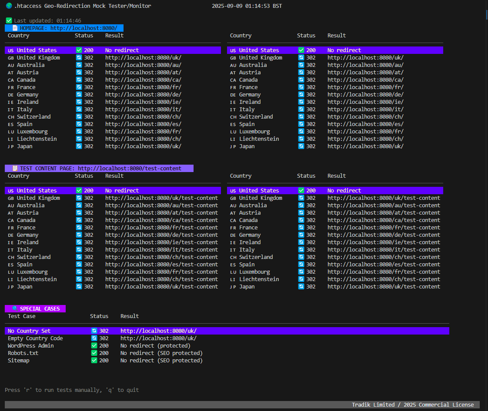
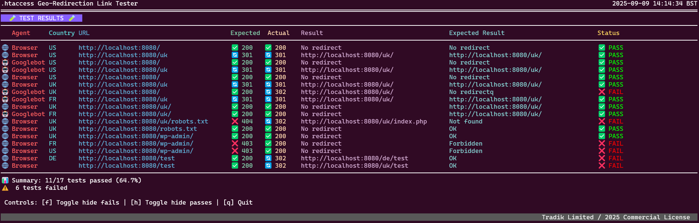
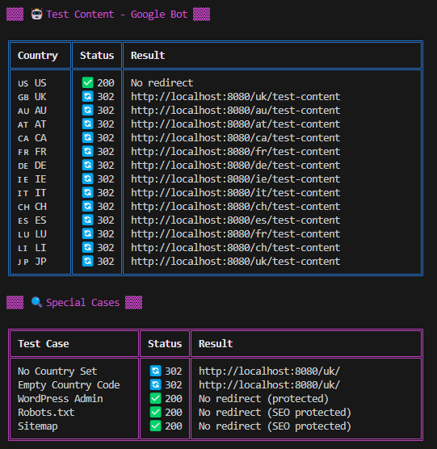
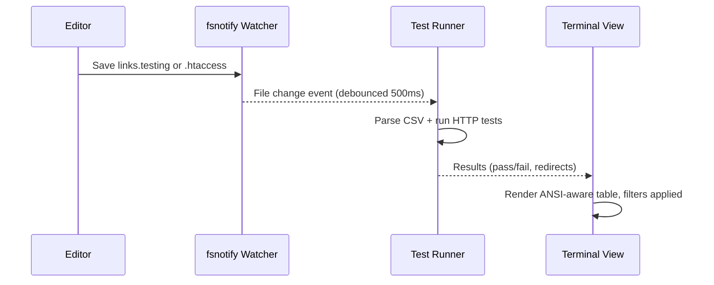
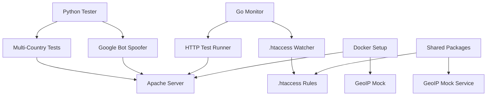

<div align="center">

# 🌍 .htaccess Geo-Redirection Mock/Testing 

[](https://github.com/spagu/htmonitor)
[](https://golang.org/)
[](https://www.python.org/)
[](https://www.docker.com/)
[](LICENSE)
[](https://github.com/spagu/htmonitor/actions/workflows/lint.yml)
[](https://github.com/spagu/htmonitor/actions/workflows/release.yml)
[](apps/htaccess-monitor/TEST_README.md)
[](apps/htaccess-monitor/TEST_README.md)
[](https://github.com/spagu/htmonitor)
[](https://www.w3.org/WAI/WCAG22/quickref/)

🚀 **Real-time Monitoring** • 🧪 **Multi-Country Testing** • 🤖 **Google Bot Spoofing** • 🐳 **Docker Ready**

A comprehensive monorepo containing tools and applications for testing geo-redirection rules, Google Bot spoofing, and website availability across multiple countries.

[🚀 Quick Start](#-installation) • [📖 Documentation](#-usage) • [🏗️ Architecture](#-architecture) • [🤝 Contributing](#-contributing)

---

</div>


## ✨ Key Features

<table>
<tr>
<td align="center">

<br/>
<strong>🖥️ Go Monitor</strong>
<br/>
Live .htaccess file watching with beautiful terminal UI
</td>
<td align="center">

<br/>
<strong>🐍 Python Tester</strong>
<br/>
Comprehensive testing across 14+ countries
</td>
<td align="center">

<br/>
<strong>🐳 Docker Setup</strong>
<br/>
Containerized Apache with GeoIP simulation
</td>
</tr>
</table>

## 🚀 Applications





### 1. htaccess-monitor (Go)
Real-time terminal UI application that monitors `.htaccess` file changes and automatically tests geo-redirection rules.

**Features:**
- 🔄 Real-time file monitoring with fsnotify
- 🖥️ Beautiful terminal UI with live updates
- 🤖 Tests both regular users and Google Bot
- 🌍 Comprehensive country coverage (US, UK, AU, AT, CA, FR, DE, IE, IT, CH, ES, LU, LI, JP)

### 2. python-tester (Python)
Comprehensive testing suite with multiple Google Bot user agents and detailed analysis.

**Features:**
- 🤖 Multiple Google Bot user agents (desktop, mobile, image, news, video, ads)
- ⚡ LiteSpeed server detection and cache analysis
- 🤖 Robots.txt parsing and validation
- 📊 JSON export capabilities with detailed results
- 🎨 Fancy bash scripts with country flags and emojis

### 3. docker-setup (Docker)
Complete Docker environment for testing geo-redirection rules.

**Features:**
- 🌐 Apache with mod_rewrite enabled
- 🗺️ GeoIP mock functionality for country simulation
- 📁 Volume mounting for live configuration updates
- 🔧 Easy service orchestration with docker-compose
- 🚀 Easy setup and teardown

## 🎯 Supported Countries

<div align="center">

| Flag | Country | Code | Redirect Path | Status |
|------|---------|------|---------------|--------|
| 🇺🇸 | United States | US | No redirect | ✅ Default |
| 🇬🇧 | United Kingdom | UK | `/uk/` | 🔄 Active |
| 🇦🇺 | Australia | AU | `/au/` | 🔄 Active |
| 🇦🇹 | Austria | AT | `/at/` | 🔄 Active |
| 🇨🇦 | Canada | CA | `/ca/` | 🔄 Active |
| 🇫🇷 | France | FR | `/fr/` | 🔄 Active |
| 🇩🇪 | Germany | DE | `/de/` | 🔄 Active |
| 🇮🇪 | Ireland | IE | `/ie/` | 🔄 Active |
| 🇮🇹 | Italy | IT | `/it/` | 🔄 Active |
| 🇨🇭 | Switzerland | CH | `/ch/` | 🔄 Active |
| 🇪🇸 | Spain | ES | `/es/` | 🔄 Active |
| 🇱🇺 | Luxembourg | LU | `/fr/` | 🔄 Active |
| 🇱🇮 | Liechtenstein | LI | `/ch/` | 🔄 Active |
| 🇯🇵 | Japan | JP | `/uk/` | 🔄 Active |

**Total Coverage:** 14 countries with comprehensive geo-redirection testing

</div>

## 📋 Prerequisites

- **GitHub CLI (gh)** for downloading pre-built binaries
- **Go 1.24+** for htaccess-monitor application (if building from source)
- **Python 3.8+** for testing suite
- **Docker & Docker Compose** for containerized testing
- **Make** for build automation

## 🚀 Installation simple

1. run `make docker-start`
2. run `make go-binary` (downloads pre-built binary)
3. edit `.htaccess` file at `.htaccess`

## 🚀 Installation advanced

1. Clone the repository:
```bash
git clone https://github.com/tradik/htmonitor.git
cd red
```

2. Install dependencies:
```bash
# Download pre-built binary (recommended)
make go-binary

# OR build from source
make go-build

# Go dependencies (if building from source)
cd apps/htaccess-monitor && go mod tidy

# Python dependencies  
pip install -r apps/python-tester/requirements.txt
```

3. Start services:
```bash
# Start Docker environment
make docker-start

# Run the monitor
make go-run
```

## 📖 Usage

### 🖥️ Go Monitor (Real-time UI)

Start the real-time terminal monitor:
```bash
make go-run
```

### 🔗 Links Watcher (auto-retest on file changes)

The Go monitor can also watch your link scenarios and `.htaccess` and automatically re-run tests whenever those files change.

- __Watches__: `links.testing` and `.htaccess`
- __Debounce__: 500ms after a write/create/rename event
- __Filters__: toggle in-place without restarting
- __Output__: ANSI-aware table kept within terminal width

Run via Makefile:
```bash
make go-test-watch
```

Or run directly:
```bash
cd apps/htaccess-monitor
# Watch links.testing and .htaccess, re-run on changes
LANG=en_US.UTF-8 LC_ALL=en_US.UTF-8 \
  go run main.go -test ../../links.testing -watch
```

__Controls__
- `f` – Toggle hide fails
- `h` – Toggle hide passes
- `q` – Quit watch mode

__CSV schema (`links.testing`)__
```
Agent, Country, URL, Expected status, Expected result
Browser, US, http://localhost:8080/ , 200, No redirect
Googlebot, UK, http://localhost:8080/ , 200, No redirect
Browser, FR, http://localhost:8080/uk , 301, http://localhost:8080/uk/
```
- __Agent__: `Browser` or `Googlebot` (case-insensitive)
- __Country__: 2-letter ISO (e.g., US, UK, FR). UK is mapped internally to GB when sent via `X-Test-Country`.
- __Expected status__: integer HTTP status (e.g., 200, 301, 302, 403, 404)
- __Expected result__:
  - For redirects, expected target substring (e.g., `http://localhost:8080/uk/`).
  - For non-redirects, use `No redirect`.

__Matching rules__
- Status code match is the primary success criteria.
- When status indicates redirect (301/302), expected result must be contained in the `Location` for a pass.
- When expected result is `No redirect`, any redirect only fails if the status code does not match the expected status.

__Flow__


__Tips__
- Use a terminal width of ≥ 120 columns for best readability.
- Keep URLs/result strings concise; long values are truncated visually with ellipses.
- You can still press `q` to exit watch mode cleanly at any time.

### 📥 Binary Download Options

The `make go-binary` command uses GitHub CLI to download pre-built binaries:

```bash
# Auto-detect system architecture (default: linux-amd64)
make go-binary

# Specify custom architecture
ARCH=darwin-arm64 make go-binary
ARCH=windows-amd64.exe make go-binary

# Specify version
VERSION=1.1.0 make go-binary

# List available architectures
./scripts/download-binary.sh --list
```

**Requirements:**
- GitHub CLI (`gh`) must be installed: https://cli.github.com/
- Alternative: Use `make go-build` to compile from source

**Supported platforms:**
- 🐧 **Linux**: amd64, arm64, 386
- 🍎 **macOS**: amd64, arm64 (Apple Silicon)
- 🪟 **Windows**: amd64, arm64, 386
- 🔥 **FreeBSD**: amd64, arm64
- 🐡 **OpenBSD**: amd64
- 🚩 **NetBSD**: amd64

**Controls:**
- `r` - Run tests manually
- `q` - Quit application

### 🐍 Python Testing Suite

**Basic Usage:**
```bash
# Test localhost with default settings
cd apps/python-tester
python googlebot_spoof_tester.py --url http://localhost:8080

# Test with all Google Bot types
python googlebot_spoof_tester.py --url http://localhost:8080 --all-bots
```

**Advanced Usage:**
```bash
# Custom timeout and delay settings
python googlebot_spoof_tester.py --url http://localhost:8080 --timeout 60 --delay 2.0

# Save results to specific file
python googlebot_spoof_tester.py --url http://localhost:8080 --output test_results.json

# Run fancy bash script with country flags
./test_all_languages.sh
```

### 🐳 Docker Environment

**Setup and run:**
```bash
# Start Docker environment
cd apps/docker-setup
docker-compose up -d

# View logs
docker-compose logs -f

# Stop environment
docker-compose down
```

**Test URLs:**
- Main site: http://localhost:8080/
- GeoIP mock: http://localhost:8080/geoip-mock.php

### 🧪 Using the Docker mock server (curl cheatsheet)

The Dockerized Apache exposes the site at `http://localhost:8080/` and simulates GeoIP via the `X-Test-Country` HTTP header. You can also spoof the Googlebot user agent with `-A`.

Quick checks (headers only):
```sh
# Check redirect behavior for US visiting /uk and /uk/
curl -s -I -H "X-Test-Country: US" "http://localhost:8080/uk/" | grep -E "(HTTP|Location)"
curl -s -I -H "X-Test-Country: US" "http://localhost:8080/uk" | grep -E "(HTTP|Location)"

# Simulate Googlebot from DE (Germany) hitting root and /uk/
curl -s -A "Mozilla/5.0 (compatible; Googlebot/2.1; +http://www.google.com/bot.html)" -H "X-Test-Country: DE" "http://localhost:8080/" && echo ""
curl -s -A "Mozilla/5.0 (compatible; Googlebot/2.1; +http://www.google.com/bot.html)" -H "X-Test-Country: DE" "http://localhost:8080/uk/" && echo ""
curl -s -A "Mozilla/5.0 (compatible; Googlebot/2.1; +http://www.google.com/bot.html)" -H "X-Test-Country: DE" "http://localhost:8080/uk/"
```

Notes:
- `-H "X-Test-Country: <CC>"` sets the simulated country (e.g., `US`, `DE`, `FR`, `UK`).
- `-A "Mozilla/5.0 (compatible; Googlebot/2.1; +http://www.google.com/bot.html)"` spoofs Googlebot.
- `-I` returns headers only (useful to inspect `HTTP` status and `Location`).
- The presence or absence of a trailing slash may affect redirects depending on `.htaccess` rules.

## 📊 Test Results

### Status Indicators
- ✅ **200** - No redirect (correct behavior)
- 🔄 **302** - Redirect detected
- ❌ **Error** - Request failed

### Special Test Cases
- **WordPress Admin** - Should not redirect (protected)
- **Robots.txt** - Should not redirect (SEO protected)
- **Sitemap** - Should not redirect (SEO protected)
- **No Country Set** - Default redirect behavior
- **Empty Country Code** - Fallback redirect behavior

## 🏗️ Architecture



## 🎨 Style Guidelines

### Colors and Contrast
- Follows WCAG 2.2 Contrast and Color Requirements
- High contrast ratios for accessibility
- Color-coded status indicators
- Terminal-friendly color schemes

### UI Components
- Clean, modern terminal interface
- Responsive layout for different screen sizes
- Intuitive keyboard controls
- Real-time updates with minimal flicker

## 🤝 Contributing

1. Fork the repository
2. Create a feature branch: `git checkout -b feature/amazing-feature`
3. Commit changes: `git commit -m 'Add amazing feature'`
4. Push to branch: `git push origin feature/amazing-feature`
5. Open a Pull Request

### Development Guidelines
- Follow clean code principles (SOC, SRP, DRY, KISS, YAGNI)
- Document your code (DYC)
- Use Test-Driven Development (TDD) when possible
- Never downgrade packages, always upgrade
- Maintain WCAG 2.2 compliance for UI elements

### Testing
The Go application includes comprehensive test coverage:

```bash
# Run unit tests
make go-test

# Run with coverage report
make go-test-coverage

# Run integration tests
make go-test-integration

# Run benchmarks
make go-test-bench

# Run all tests
make go-test-all
```

**Test Coverage:** 19.5% of statements (focused on business logic)

For detailed testing documentation, see [apps/htaccess-monitor/TEST_README.md](apps/htaccess-monitor/TEST_README.md)

### CI/CD
Automated workflows ensure code quality and streamlined releases:

**🔍 Lint Workflow** (on push/PR to main/develop)
- Runs `go vet`, `go fmt`, and `golangci-lint`
- Executes unit and integration tests with race detector
- Uploads coverage to Codecov

**🚀 Release Workflow** (on merge to main)
- Auto-increments version (patch)
- Builds binaries for 6 platforms:
  - Linux (AMD64, ARM64)
  - macOS (AMD64, ARM64)
  - FreeBSD (AMD64, ARM64)
- Creates GitHub release with checksums
- Auto-generates changelog from commits

For workflow details, see [.github/workflows/README.md](.github/workflows/README.md)

## 📄 License

This project is licensed under a **Commercial License** - see the [LICENSE](LICENSE) file for details.

**Copyright 2025 Tradik Limited. All rights reserved.**

This software is proprietary and confidential. Unauthorized copying, distribution, or use is strictly prohibited. For licensing inquiries, contact: legal@tradik.com

## 🆘 Troubleshooting

### Common Issues

**Go Monitor not starting:**
```bash
cd apps/htaccess-monitor
go mod tidy
go run main.go
```

**Python tests failing:**
```bash
cd apps/python-tester
pip install -r requirements.txt
python googlebot_spoof_tester.py --url http://localhost:8080
```

**Docker services not accessible:**
```bash
cd apps/docker-setup
docker-compose down
docker-compose up -d
```

### Logs and Debugging

- **Go Monitor**: Check terminal output for errors
- **Python Tests**: Results saved to JSON files
- **Docker**: Use `docker-compose logs -f` for service logs
- **Apache**: Check container logs for .htaccess issues

## 🔗 Related Documentation

- [🏗️ System Architecture](docs/ARCHITECTURE.md)
- [📝 .htaccess Documentation](docs/HTACCESS_DOCUMENTATION.md)
- [🐳 Docker Setup Guide](docs/README-DOCKER.md)
- [🖥️ Go Monitor README](apps/htaccess-monitor/README.md)
- [🐍 Python Tester README](apps/python-tester/README.md)
- [🐳 Docker Setup README](apps/docker-setup/README.md)
- [📊 Test Scripts](apps/test-scripts/)

## 🏗️ Monorepo Structure

```
red/
├── apps/                           # Main applications
│   ├── htaccess-monitor/          # Go terminal UI monitor
│   │   ├── main.go
│   │   ├── go.mod
│   │   ├── go.sum
│   │   └── README.md
│   ├── python-tester/             # Python testing suite
│   │   ├── googlebot_spoof_tester.py
│   │   ├── test_all_languages.sh
│   │   ├── requirements.txt
│   │   └── README.md
│   ├── docker-setup/              # Docker configuration
│   │   ├── Dockerfile
│   │   ├── docker-compose.yml
│   │   ├── apache-vhost.conf
│   │   └── README.md
│   └── test-scripts/              # Testing utilities
│       └── test-countries.sh
├── packages/                       # Shared packages
│   └── shared/                    # Common configurations
│       ├── .htaccess              # Geo-redirection rules
│       ├── geoip-mock.php         # GeoIP mock service
│       └── README.md
├── docs/                           # Documentation
│   ├── ARCHITECTURE.md            # System architecture
│   ├── HTACCESS_DOCUMENTATION.md  # .htaccess guide
│   └── README-DOCKER.md           # Docker setup guide
├── logs/                           # Application logs
│   ├── access.log
│   ├── error.log
│   └── other_vhosts_access.log
├── Makefile                        # Build automation
├── CHANGELOG.md                    # Version history
├── workspace.json                  # Workspace configuration
└── README.md                       # This file
```


---

<div align="center">

** 2025 Tradik Limited - Commercial License**

Made with ❤️ for geo-redirection testing

</div>

See [CHANGELOG.md](CHANGELOG.md) for version history and updates.
