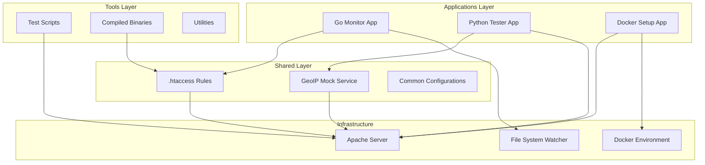
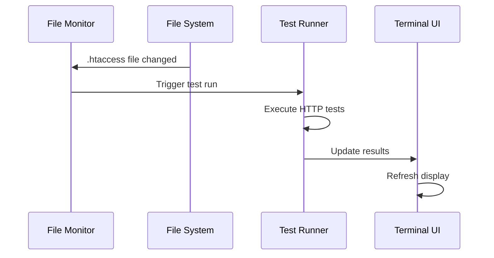
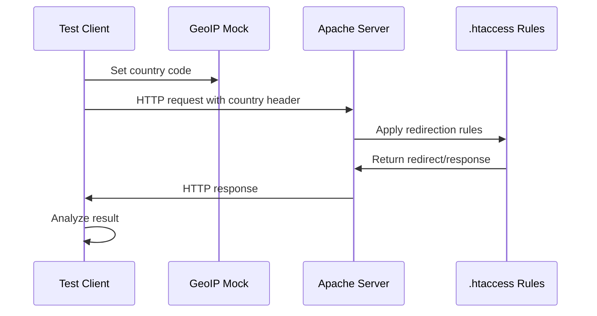
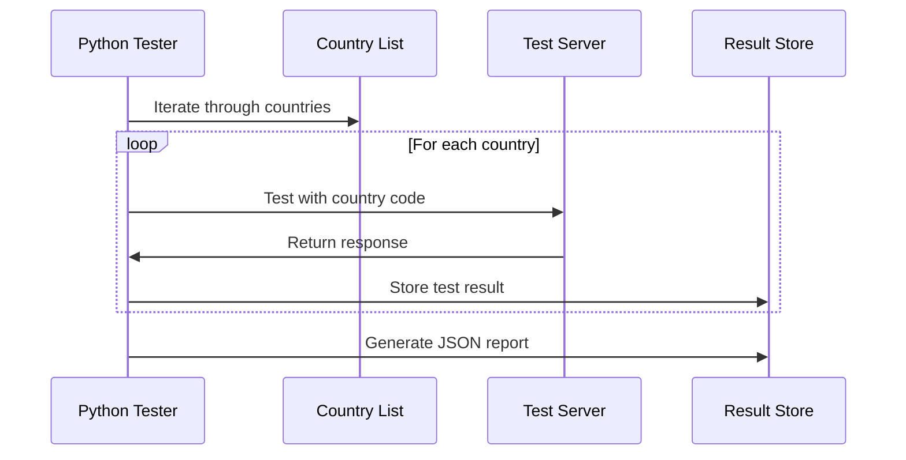
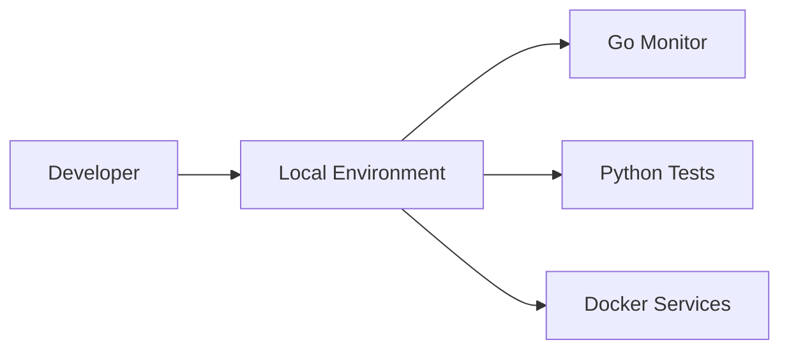
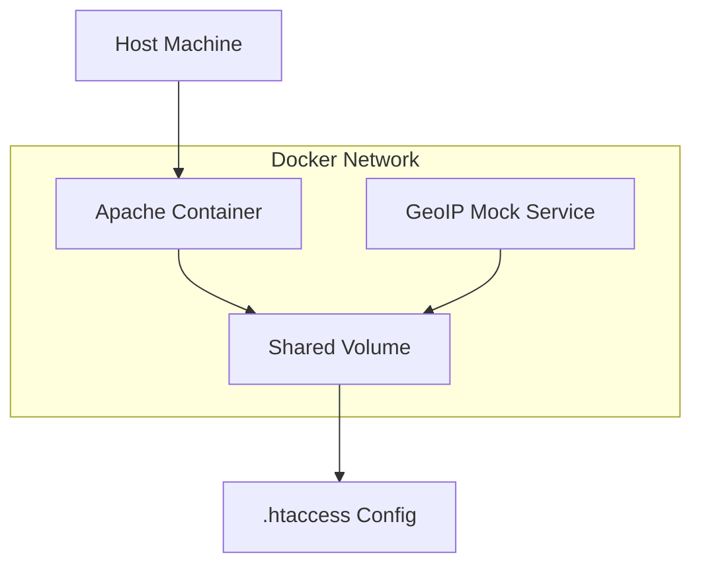

# Architecture Documentation

## 🏗️ System Architecture

The .htaccess Geo-Redirection Testing Monorepo follows a modular architecture with clear separation of concerns.



## 📦 Component Overview

### Applications (`apps/`)

#### htaccess-monitor
- **Technology**: Go with Bubble Tea TUI framework
- **Purpose**: Real-time monitoring and testing
- **Features**:
  - File system watcher for .htaccess changes
  - Terminal UI with live updates
  - HTTP test runner
  - Multi-country testing

#### python-tester
- **Technology**: Python 3.8+
- **Purpose**: Comprehensive testing suite
- **Features**:
  - Google Bot user agent spoofing
  - LiteSpeed server detection
  - JSON result export
  - Bash scripts with visual output

#### docker-setup
- **Technology**: Docker & Docker Compose
- **Purpose**: Containerized testing environment
- **Features**:
  - Apache with mod_rewrite
  - GeoIP simulation
  - Volume mounting
  - Service orchestration

### Shared Packages (`packages/`)

#### shared
- **Purpose**: Common configurations and resources
- **Contents**:
  - `.htaccess` - Geo-redirection rules
  - `geoip-mock.php` - Country simulation service
  - Shared documentation

### Tools (`tools/`)

- **test-scripts/**: Testing utilities and scripts
- **htaccess-monitor**: Compiled Go binary
- **wpexportjson-linux-amd64**: WordPress utility

## 🔄 Data Flow

### 1. File Monitoring Flow


### 2. HTTP Testing Flow


### 3. Multi-Country Testing


## 🧩 Design Patterns

### 1. Observer Pattern
- **File Watcher**: Observes .htaccess file changes
- **UI Updates**: Observes test result changes
- **Implementation**: Go channels and fsnotify

### 2. Strategy Pattern
- **User Agents**: Different Google Bot strategies
- **Test Types**: Regular vs Bot testing strategies
- **Output Formats**: JSON, Terminal, Log formats

### 3. Factory Pattern
- **Test Creation**: Creates different test types
- **HTTP Clients**: Creates configured HTTP clients
- **Result Formatters**: Creates appropriate formatters

### 4. Command Pattern
- **Test Execution**: Encapsulates test operations
- **UI Actions**: Keyboard command handling
- **Make Targets**: Build and test commands

## 🔧 Configuration Management

### Environment Variables
```bash
GEOIP_COUNTRY_CODE=AU    # Country simulation
HTTP_TIMEOUT=30          # Request timeout
TEST_DELAY=1.0          # Delay between tests
LOG_LEVEL=INFO          # Logging level
```

### Configuration Files
- `.htaccess` - Apache rewrite rules
- `apps/docker-setup/docker-compose.yml` - Service configuration
- `apps/*/go.mod` - Go module dependencies
- `apps/*/requirements.txt` - Python dependencies

## 🚀 Deployment Architecture

### Local Development


### Docker Environment


## 📊 Performance Considerations

### Monitoring Performance
- **File Watcher**: Minimal CPU usage with fsnotify
- **HTTP Tests**: Configurable delays to prevent overload
- **UI Updates**: Efficient terminal rendering with Bubble Tea

### Scalability
- **Concurrent Testing**: Go goroutines for parallel tests
- **Resource Management**: Proper cleanup and connection pooling
- **Memory Usage**: Streaming results for large test suites

### Optimization
- **Caching**: HTTP client reuse
- **Batching**: Group similar tests
- **Lazy Loading**: Load resources on demand

## 🔒 Security Considerations

### Input Validation
- URL validation for test targets
- Country code validation
- File path sanitization

### Network Security
- Local testing environment isolation
- No external network calls in production
- Secure Docker container configuration

### Data Protection
- No sensitive data in logs
- Temporary file cleanup
- Secure configuration management

## 🧪 Testing Strategy

### Unit Testing
- Go: Standard testing package
- Python: pytest framework
- Coverage: Aim for >80% coverage

### Integration Testing
- End-to-end test flows
- Docker environment testing
- Cross-platform compatibility

### Performance Testing
- Load testing with multiple countries
- Memory usage monitoring
- Response time benchmarking

## 📈 Monitoring and Observability

### Logging
- Structured logging with levels
- Rotation and cleanup policies
- Error tracking and alerting

### Metrics
- Test execution times
- Success/failure rates
- Resource utilization

### Health Checks
- Service availability monitoring
- Configuration validation
- Dependency health checks