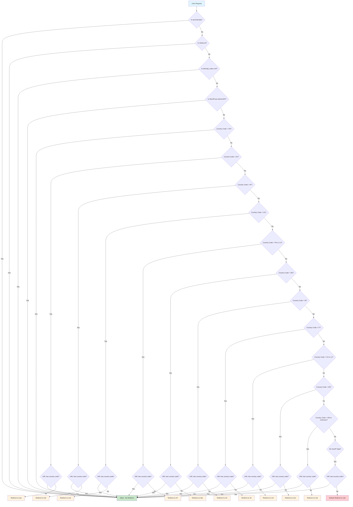

# .htaccess File Documentation

## Overview

This `.htaccess` file implements a sophisticated geo-redirection system for a WordPress website using LiteSpeed server. It automatically redirects users to country-specific subdirectories based on their geographic location while maintaining SEO-friendly URLs and proper caching mechanisms.

## Table of Contents

1. [File Structure](#file-structure)
2. [Section-by-Section Analysis](#section-by-section-analysis)
3. [Geo-Redirection Flow Diagram](#geo-redirection-flow-diagram)
4. [Country Codes and Mappings](#country-codes-and-mappings)
5. [Technical Implementation Details](#technical-implementation-details)
6. [LiteSpeed Cache Configuration](#litespeed-cache-configuration)
7. [WordPress Integration](#wordpress-integration)

---

## File Structure

The `.htaccess` file is organized into several distinct sections:

```
📁 .htaccess Structure
├── 🚫 Exclusion Rules (Lines 3-19)
├── 🌍 Geo-Redirection Rules (Lines 21-90)
├── ⚡ LiteSpeed Cache Configuration (Lines 92-134)
├── 🗂️ Browser Cache Settings (Lines 135-176)
├── 🔧 WordPress Core Rules (Lines 178-192)
└── 🚀 LiteSpeed Module Settings (Lines 193-200)
```

---

## Section-by-Section Analysis

### 🚫 Section 1: Exclusion Rules (Lines 3-19)

This section prevents certain URLs from being processed by the geo-redirection system.

#### Lines 3-4: WordPress Core File Protection
```apache
RewriteCond %{REQUEST_URI} ^/wp-load\.php$ [NC]
RewriteRule ^ - [L]
```
**Explanation:**
- **Line 3**: Checks if the requested URI exactly matches `/wp-load.php` (case-insensitive)
- **Line 4**: If matched, do nothing (`-`) and stop processing (`[L]` = Last rule)
- **Purpose**: Protects WordPress core file from redirection

#### Lines 6-7: SEO Files Protection
```apache
RewriteCond %{REQUEST_URI} ^/robots\.txt$ [NC]
RewriteRule ^ - [L]
```
**Explanation:**
- **Line 6**: Checks for exact match of `/robots.txt`
- **Line 7**: Bypasses redirection for robots.txt
- **Purpose**: Ensures search engines can access robots.txt at root level

#### Lines 9-10: Sitemap Protection
```apache
RewriteCond %{REQUEST_URI} ^/sitemap_index\.xml$ [NC]
RewriteRule ^ - [L]
```
**Explanation:**
- **Line 9**: Protects the main sitemap index file
- **Line 10**: Prevents redirection of sitemap files
- **Purpose**: Maintains SEO integrity for XML sitemaps

#### Lines 11-13: Commented Country Code Exclusion
```apache
# Exclude if URL contains a country code
# RewriteCond %{REQUEST_URI} ^/(au|at|ca|fr|de|ie|it|ch|es|uk|us|lu|li)(/|$) [NC]
# RewriteRule ^ - [L]
```
**Explanation:**
- **Commented out**: This rule would prevent redirection if URL already contains a country code
- **Purpose**: Would avoid infinite redirects (currently handled differently)

#### Lines 15-19: WordPress Admin Protection
```apache
# Exclude if URL contains wp-json or wp-admin
RewriteCond %{REQUEST_URI} (wp-json|wp-admin|wp-login|wp-content|wp-includes|wc-admin) [NC]
RewriteCond %{REQUEST_URI} !wc-api [NC]
RewriteCond %{REQUEST_URI} !wp-json [NC]
RewriteRule ^ - [L]
```
**Explanation:**
- **Line 16**: Matches WordPress admin and API URLs
- **Line 17**: Exception for WooCommerce API (`!wc-api` = NOT wc-api)
- **Line 18**: Exception for wp-json API
- **Line 19**: Skip redirection for WordPress admin areas
- **Purpose**: Prevents breaking WordPress functionality

---

### 🌍 Section 2: Geo-Redirection Rules (Lines 21-90)

This is the core geo-redirection system that routes users based on their country.

#### Lines 21-23: USA (No Redirect)
```apache
# USA (no redirect, just pass through)
RewriteCond %{ENV:GEOIP_COUNTRY_CODE} ^US$
RewriteRule ^ - [L]
```
**Explanation:**
- **Line 22**: Checks if user's country is US
- **Line 23**: No redirection for US users (they stay on root domain)
- **Purpose**: US is the default/primary market

#### Lines 25-29: Australia Redirection
```apache
# Australia
RewriteCond %{ENV:GEOIP_COUNTRY_CODE} ^AU$
RewriteCond %{REQUEST_URI} !^/(au|at|ca|fr|de|ie|it|ch|es|uk|us|lu|li|ch-fr|ch-it|ca-fr)(/|$) [NC]
RewriteCond %{REQUEST_URI} !wp-json [NC]
RewriteRule ^(.*)$ /au/$1 [R=302,L,QSA]
```
**Explanation:**
- **Line 26**: Matches Australian users (`GEOIP_COUNTRY_CODE = AU`)
- **Line 27**: Ensures URL doesn't already contain a country code
- **Line 28**: Excludes wp-json API calls
- **Line 29**: Redirects to `/au/` subdirectory with 302 redirect, preserving query strings
- **Purpose**: Routes Australian users to localized content

**Pattern Repeats for Each Country:**
- **Austria (AT)** → `/at/` (Lines 31-35)
- **Canada (CA)** → `/ca/` (Lines 37-41)
- **France & Luxembourg (FR|LU)** → `/fr/` (Lines 43-47)
- **Germany (DE)** → `/de/` (Lines 49-53)
- **Ireland (IE)** → `/ie/` (Lines 55-59)
- **Italy (IT)** → `/it/` (Lines 61-65)
- **Switzerland & Liechtenstein (CH|LI)** → `/ch/` (Lines 67-71)
- **Spain (ES)** → `/es/` (Lines 73-77)

#### Lines 79-84: UK & Default Fallback
```apache
# United Kingdom & Default
RewriteCond %{ENV:GEOIP_COUNTRY_CODE} ^GB$ [OR]
RewriteCond %{ENV:GEOIP_COUNTRY_CODE} !^(AU|AT|CA|FR|DE|IE|IT|CH|LI|ES|GB|US|LU)$
RewriteCond %{REQUEST_URI} !^/(au|at|ca|fr|de|ie|it|ch|es|uk|us|lu|li|ch-fr|ch-it|ca-fr)(/|$) [NC]
RewriteCond %{REQUEST_URI} !uk [NC]
RewriteRule ^(.*)$ /uk/$1 [R=302,L,QSA]
```
**Explanation:**
- **Line 80**: Matches UK users (`GB`) OR
- **Line 81**: Any country NOT in the supported list (fallback)
- **Line 82**: URL doesn't already contain country code
- **Line 83**: URL doesn't already contain 'uk'
- **Line 84**: Redirect to `/uk/` subdirectory
- **Purpose**: UK users + fallback for unsupported countries

#### Lines 86-90: Empty GeoIP Fallback
```apache
# If no GEOIP_COUNTRY_CODE is set, redirect to /uk/ as default
RewriteCond %{ENV:GEOIP_COUNTRY_CODE} ^$
RewriteCond %{REQUEST_URI} !^/(au|at|ca|fr|de|ie|it|ch|es|uk|us|lu|li|ch-fr|ch-it|ca-fr)(/|$) [NC]
RewriteCond %{REQUEST_URI} !wp-json [NC]
RewriteRule ^(.*)$ /uk/$1 [R=302,L,QSA]
```
**Explanation:**
- **Line 87**: Checks if GeoIP country code is empty
- **Line 88**: URL doesn't contain country code
- **Line 89**: Not a wp-json API call
- **Line 90**: Default redirect to UK
- **Purpose**: Safety net when GeoIP detection fails

---

### ⚡ Section 3: LiteSpeed Cache Configuration (Lines 92-134)

Advanced caching configuration for LiteSpeed server.

#### Lines 94-99: Core Cache Settings
```apache
<IfModule LiteSpeed>
RewriteEngine on
CacheLookup on
RewriteRule .* - [E=Cache-Control:no-autoflush]
RewriteRule litespeed/debug/.*\.log$ - [F,L]
RewriteRule \.litespeed_conf\.dat - [F,L]
```
**Explanation:**
- **Line 95**: Enable rewrite engine within LiteSpeed module
- **Line 96**: Enable cache lookup
- **Line 97**: Set cache control to prevent auto-flush
- **Line 98**: Forbid access to LiteSpeed debug logs
- **Line 99**: Forbid access to LiteSpeed config files
- **Purpose**: Core caching functionality and security

#### Lines 101-105: Async Processing
```apache
### marker ASYNC start ###
RewriteCond %{REQUEST_URI} /wp-admin/admin-ajax\.php
RewriteCond %{QUERY_STRING} action=async_litespeed
RewriteRule .* - [E=noabort:1]
### marker ASYNC end ###
```
**Explanation:**
- **Line 102**: Matches WordPress AJAX admin calls
- **Line 103**: Specifically for LiteSpeed async actions
- **Line 104**: Set environment variable to prevent connection abort
- **Purpose**: Optimize AJAX performance

#### Lines 107-110: Mobile Detection
```apache
### marker MOBILE start ###
RewriteCond %{HTTP_USER_AGENT} Mobile|Android|Silk/|Kindle|BlackBerry|Opera\ Mini|Opera\ Mobi [NC]
RewriteRule .* - [E=Cache-Control:vary=%{ENV:LSCACHE_VARY_VALUE}+ismobile]
### marker MOBILE end ###
```
**Explanation:**
- **Line 108**: Detects mobile user agents
- **Line 109**: Creates separate cache for mobile users
- **Purpose**: Mobile-optimized caching

#### Lines 112-114: Login Cookie Handling
```apache
### marker LOGIN COOKIE start ###
RewriteRule .? - [E="Cache-Vary:wp-wpml_current_language,,wp-postpass_4c6019f2292405368530c583968c4201"]
### marker LOGIN COOKIE end ###
```
**Explanation:**
- **Line 113**: Sets cache variation for logged-in users and WPML language
- **Purpose**: Personalized content caching

#### Lines 116-121: WebP Image Support
```apache
### marker WEBP start ###
RewriteCond %{HTTP_ACCEPT} image/webp [OR]
RewriteCond %{HTTP_USER_AGENT} iPhone.*Version/(1[4-9]|[2-9][0-9]|[1-9][0-9]{2,}).*Safari [OR]
RewriteCond %{HTTP_USER_AGENT} Firefox/([6-9][0-9]|[1-9][0-9]{2,})
RewriteRule .* - [E=Cache-Control:vary=%{ENV:LSCACHE_VARY_VALUE}+webp]
### marker WEBP end ###
```
**Explanation:**
- **Line 117**: Browser accepts WebP images OR
- **Line 118**: Modern iPhone Safari OR
- **Line 119**: Modern Firefox browser
- **Line 120**: Create separate cache for WebP-capable browsers
- **Purpose**: Optimized image delivery

#### Lines 123-130: Query String Cleanup
```apache
### marker DROPQS start ###
CacheKeyModify -qs:fbclid
CacheKeyModify -qs:gclid
CacheKeyModify -qs:utm*
CacheKeyModify -qs:_ga
CacheKeyModify -qs:clickid
CacheKeyModify -qs:mpid
### marker DROPQS end ###
```
**Explanation:**
- **Lines 124-129**: Remove tracking parameters from cache keys
- **Purpose**: Improve cache hit rates by ignoring tracking parameters

---

### 🗂️ Section 4: Browser Cache Settings (Lines 135-176)

Long-term browser caching for static assets.

#### Lines 138-172: File Type Expiration
```apache
<IfModule mod_expires.c>
ExpiresActive on
ExpiresByType application/pdf A31557600
ExpiresByType image/x-icon A31557600
# ... (multiple file types)
</IfModule>
```
**Explanation:**
- **A31557600**: 1 year expiration (31,557,600 seconds)
- **File Types Covered**: PDFs, images, videos, CSS, JavaScript, fonts
- **Purpose**: Reduce server load and improve page speed

---

### 🔧 Section 5: WordPress Core Rules (Lines 178-192)

Standard WordPress rewrite rules.

```apache
<IfModule mod_rewrite.c>
RewriteEngine On
RewriteRule .* - [E=HTTP_AUTHORIZATION:%{HTTP:Authorization}]
RewriteBase /
RewriteRule ^index\.php$ - [L]
RewriteCond %{REQUEST_FILENAME} !-f
RewriteCond %{REQUEST_FILENAME} !-d
RewriteRule . /index.php [L]
</IfModule>
```
**Explanation:**
- **Line 184**: Pass HTTP authorization headers
- **Line 185**: Set base directory
- **Line 186**: Don't rewrite direct index.php calls
- **Lines 187-189**: Route all requests to index.php if file/directory doesn't exist
- **Purpose**: WordPress permalink functionality

---

### 🚀 Section 6: LiteSpeed Module Settings (Lines 193-200)

Additional LiteSpeed configuration.

```apache
<IfModule Litespeed>
SetEnv noabort 1
</IfModule>
```
**Explanation:**
- **Line 198**: Prevent connection abort for long-running processes
- **Purpose**: Improve reliability for complex operations

---

## Geo-Redirection Flow Diagram



---

## Country Codes and Mappings

| Country Code | Country/Region | Redirect Path | Notes |
|--------------|----------------|---------------|-------|
| `US` | United States | No redirect | Primary market |
| `AU` | Australia | `/au/` | |
| `AT` | Austria | `/at/` | |
| `CA` | Canada | `/ca/` | |
| `FR` | France | `/fr/` | Also handles Luxembourg |
| `LU` | Luxembourg | `/fr/` | Shares French content |
| `DE` | Germany | `/de/` | |
| `IE` | Ireland | `/ie/` | |
| `IT` | Italy | `/it/` | |
| `CH` | Switzerland | `/ch/` | Also handles Liechtenstein |
| `LI` | Liechtenstein | `/ch/` | Shares Swiss content |
| `ES` | Spain | `/es/` | |
| `GB` | United Kingdom | `/uk/` | Also default fallback |
| **Unknown** | Any other country | `/uk/` | Default fallback |
| **No GeoIP** | GeoIP failure | `/uk/` | Safety net |

### Special Language Variants

The system also supports these language-specific paths (though not actively redirected to):
- `/ch-fr/` - Switzerland (French)
- `/ch-it/` - Switzerland (Italian)  
- `/ca-fr/` - Canada (French)

---

## Technical Implementation Details

### GeoIP Integration
- Uses `%{ENV:GEOIP_COUNTRY_CODE}` environment variable
- Requires GeoIP module on server
- Falls back to UK if GeoIP unavailable

### Redirect Strategy
- **302 Temporary Redirects**: Allows flexibility for testing and changes
- **QSA Flag**: Query String Append - preserves URL parameters
- **L Flag**: Last rule - stops processing after match

### Cache Optimization
- **Mobile Detection**: Separate cache for mobile users
- **WebP Support**: Optimized image delivery
- **Query String Cleanup**: Better cache hit rates
- **Long Expiration**: 1-year browser cache for static assets

### WordPress Integration
- Protects admin areas from redirection
- Maintains API functionality
- Preserves permalink structure
- Handles authorization headers

---

## Performance Considerations

### Cache Hit Rate Optimization
1. **Query Parameter Removal**: Tracking parameters don't affect cache keys
2. **Mobile Separation**: Different cache for mobile/desktop
3. **WebP Variants**: Separate cache for modern browsers
4. **User Context**: Logged-in users get personalized cache

### SEO Benefits
1. **Country-Specific Content**: Better local search rankings
2. **Proper Redirects**: 302 redirects preserve link equity
3. **Robots.txt Protection**: Search engines find sitemap correctly
4. **Clean URLs**: Tracking parameters don't create duplicate content

### Security Features
1. **Debug Log Protection**: LiteSpeed logs are forbidden
2. **Config File Protection**: Server configuration files blocked
3. **Admin Area Protection**: WordPress admin remains functional

---

## Troubleshooting Guide

### Common Issues

1. **Infinite Redirects**
   - Check if URL already contains country code
   - Verify exclusion rules are working

2. **WordPress Admin Issues**
   - Ensure wp-admin exclusion rules are active
   - Check wp-json API accessibility

3. **Cache Problems**
   - Verify LiteSpeed module is loaded
   - Check cache vary headers

4. **GeoIP Not Working**
   - Confirm GeoIP module installation
   - Test with manual country code setting

### Testing Commands

```bash
# Test geo-redirection
curl -I https://tradik.com/ -H "X-Forwarded-For: 1.2.3.4"

# Test with Google Bot
curl -I https://tradik.com/ -A "Mozilla/5.0 (compatible; Googlebot/2.1; +http://www.google.com/bot.html)"

# Test specific country
curl -I https://tradik.com/ -H "CF-IPCountry: AU"
```

---

## Maintenance Notes

### Regular Checks
- Monitor redirect performance
- Verify GeoIP database updates
- Check cache hit rates
- Test mobile/desktop variants

### Updates Required When
- Adding new countries
- Changing default fallback
- Modifying cache strategy
- WordPress core updates

---

*This documentation covers the complete .htaccess configuration for the tradik.com geo-redirection system. For technical support or modifications, ensure proper testing in a staging environment first.*
